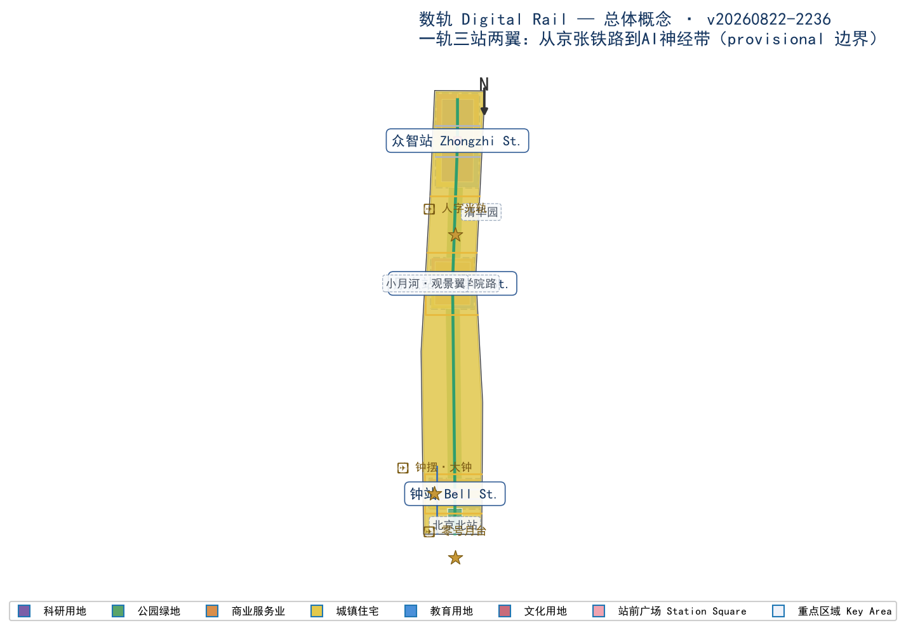
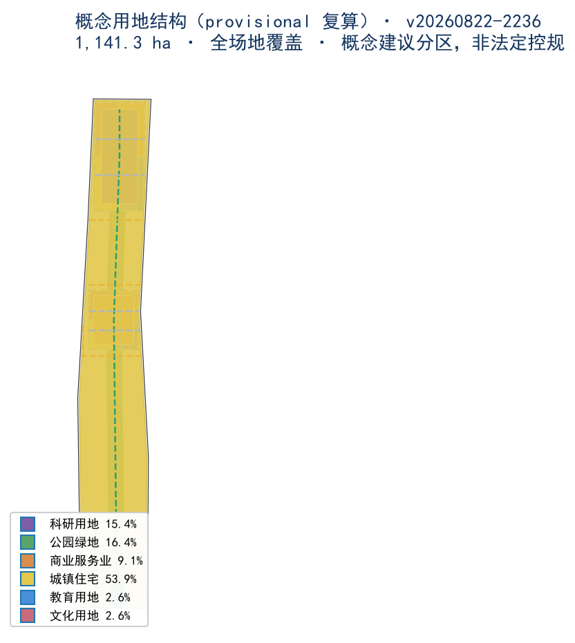
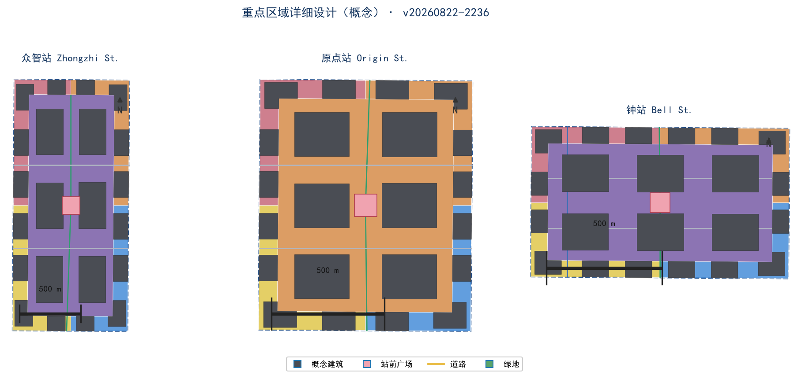
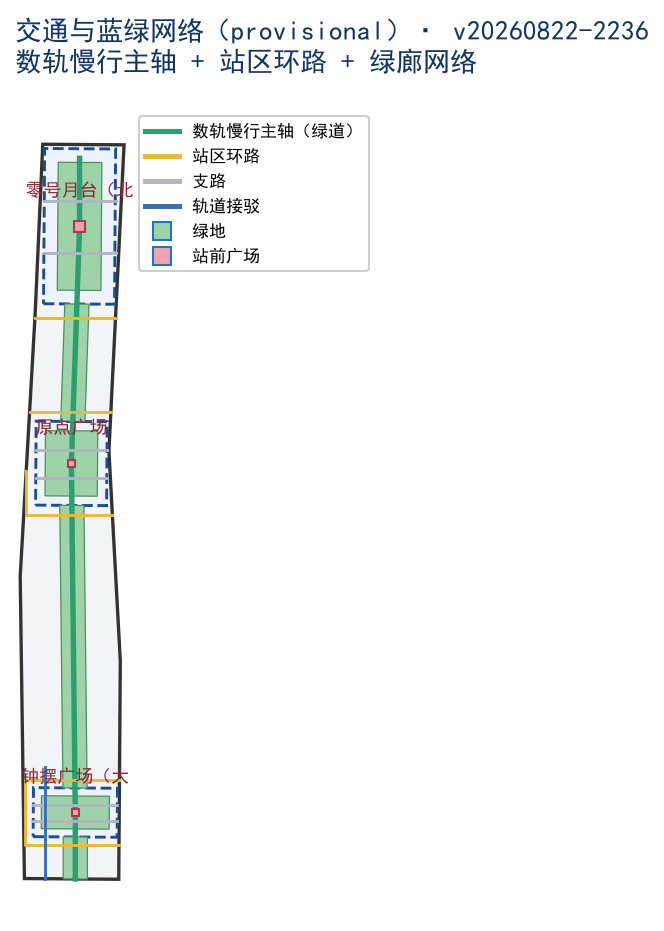
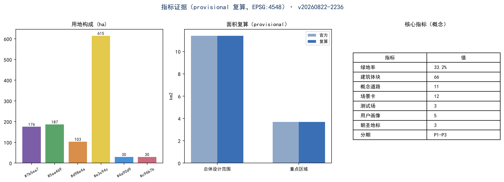

# 数轨 Digital Rail：从京张铁路到AI神经带——百年京张AI创新带城市设计概念方案

## 设计依据与资料清单

本 formal 方案以北京市规划和自然资源委员会海淀分局发布的《百年京张AI创新带城市设计国际方案征集资格预审公告》为第一依据，并以 `brief/site-package/` 中经维护者登记的临时粗略边界、重点区域、枚举、指标和来源清单为机器可读依据 [standard:PROJECT-OFFICIAL-ANNOUNCEMENT]。AI agent 在生成方案前读取了 `design_brief.json`、`allowed_design_space.json`、`sources.json`、`enums/`、`ranges/`、`schemas/`、`data/source_registry.json` 与面向智能体任务书摘录，并据此建立任务、范围、资料用途和缺口清单 [source:AGENT-TASKBOOK]。所有设计判断均拆分为可追溯来源、可复算指标、可校验图层和可人工复核假设；文本叙述不能替代 GeoJSON、指标表、A3 文册、A0 展板和 HTML 电子展示成果 [depth:existing_conditions_diagnosis]。

本方案不是独立愿景文本，而是从公告、面向智能体任务书和场地资料出发组织的成果；本节只把最关键依据放在判断旁边 [source:OFFICIAL-ANNOUNCEMENT] [source:AGENT-TASKBOOK]。完整来源和标准覆盖分别保存在 `sources.json`、`standard_matrix.json` 与 `design_depth_matrix.json`，不在正文重复机器索引。

资料登记表的使用边界如下 [source:SOURCE-REGISTRY]：

- `data/source_registry.json` 登记公开、清权与临时资料的用途边界。
- 当前登记摘要：formal 可用资料 7 条，背景资料 1 条，provisional-only 资料 1 条。
- agent 不得把 background_only 或 provisional_only 资料升级为 official boundary、法定控规、正式评分依据或政府实施承诺。

`data/processed/agent_fact_pack.md` 是本方案的阅读导航层，不是新的权威来源 [source:PROCESSED-FACT-PACK]。它帮助 agent 把三层范围、三处重点区、公告任务、agent.1-agent.6、资料可用性和缺资料事项组织成可读方案；事实判断仍需回到已登记的原始材料 [source:OFFICIAL-ANNOUNCEMENT] [source:AGENT-TASKBOOK]。

本脚手架在官方 `SITE_BOUNDARY` 或三处 `KEY_AREA` 尚未取得时，使用 `brief/site-package/geometry/provisional_boundaries.geojson` 生成临时 formal 包。提交包中的 `geometry/site_boundary.geojson` 与 `geometry/key_areas.geojson` 均标注为 `provisional_constraint`、`official_boundary=false`，只能用于方案生成、自检、可视化和设计讨论，不能作为 official redline、审批依据、精确面积依据或法定控制结论 [source:BOUNDARY-SOURCE]。本方案未使用任何商业地图瓦片；全部概念几何为本 agent 自建数据，未使用任何地图服务数据。

本次脚手架生成的可评分状态为：**临时边界，保留精度警示并待正式数据发布后复算；不阻断内容评分**。正文中的空间结构、场景、项目和指标均按“可讨论、可复核、可替换官方边界后重算”的原则写入。

边界解释可回到总体范围图层和面积复算 [data:geometry/site_boundary.geojson#SITE-001] [metric:site_area_sqm]；三处重点区由独立图层和数量指标核对 [data:geometry/key_areas.geojson#PROV-KEY-001] [metric:key_area_count]。

## 三层范围工作框架

方案按照公告确定的三个层次组织工作 [standard:PROJECT-OFFICIAL-ANNOUNCEMENT]：统筹研究范围关注 43.6 平方公里的AI产业生态、战略定位、创新链和未来城市形态 [metric:coordinated_research_area_sqm]；总体设计范围关注 11.4 平方公里京张遗址公园周边 1-2 公里城市地区和产业区 [metric:overall_design_area_sqm]，形成城市更新总体框架、产业空间布局、交通市政支撑和城市风貌控制；重点区域范围关注 368.4 公顷三处详细设计地区 [metric:key_detailed_design_area_sqm]，明确功能业态、建筑规模、拆改留分类、公共空间连通和交通组织 [data:geometry/key_areas.geojson]。三层范围在 `compliance_matrix.json` 中逐条映射，保证公告任务与 agent.1-agent.6 必选任务都有章节、图层、指标、图纸和 HTML 证据 [source:AGENT-TASKBOOK]。

三层工作框架的深度项由 [depth:three_level_scope_framework] 和 [depth:overall_spatial_structure] 约束，空间证据以 [data:geometry/site_boundary.geojson#SITE-001] 与 [data:geometry/key_areas.geojson#PROV-KEY-001] 为准，任务依据以 [standard:PROJECT-OFFICIAL-ANNOUNCEMENT] 为准。

三层工作不是互相割裂的图纸集合：统筹研究决定产业链和城市形态判断，总体设计把判断落实到更新项目、空间结构和设施承载，重点区域详细设计验证具体地块、建筑、交通、公共空间和AI应用场景的可实施性。任何无法从结构化数据复算的面积、比例、规模或项目数量，不得写入正式结论 [depth:three_level_scope_framework]。

### 总体概念：数轨 Digital Rail

本方案的总体概念为**「数轨 Digital Rail」：从京张铁路到AI神经带**。1909 年詹天佑主持设计京张铁路，以「人」字形展线翻越八达岭，是中国人自主勘测设计的第一条干线铁路；一百年后，同一片土地要铺设一条新的轨道——「数轨」：把京张铁路遗产公园作为**记忆轨**（历史与公共空间的脊柱），让数据流、算力流与智能体沿这条轨道运行，构成**AI神经带**（AI 创新生态的动线）。铁路时代运送的是列车与人，数轨时代运送的是数据、模型与场景 [source:AGENT-TASKBOOK]。

概念转译为可操作的空间结构：**一轨三站两翼**。

- **一轨**：京张遗址公园活力带即「记忆轨」主轴——南北贯通、东西缝合、公共空间活化、青年友好的慢行与场景主轴 [data:geometry/roads.geojson#ROAD-001]。
- **三站**：三处重点区域按「车站」逻辑命名与组织，每一站一个主题、一个地标、一组场景：
  - **众智站（加速站）**——众智园AI自主创新加速区，全栈创新与加速 [data:geometry/key_areas.geojson#PROV-KEY-001]；
  - **原点站（源站）**——北京AI原点社区，开源协作与人才活力 [data:geometry/key_areas.geojson#PROV-KEY-002]；
  - **钟站（钟摆站）**——大钟寺AI产业聚集区，产业集聚与AI健康 [data:geometry/key_areas.geojson#PROV-KEY-003]。
- **两翼**：中关村科技服务翼为**牵引翼**（资本、IP、科技服务，如机车牵引全带）；小月河场景赋能翼为**观景翼**（AI生活体验与场景落地，如观光车厢）。

命名系统、视觉识别与 Logo 方向（见「AI 创新生态、人才画像与 AI+ 场景」章）均围绕「站」的意象展开：站台、车票、时刻表、信号灯、道岔——把 AI 创新带读作一张永不停歇的「时刻表」[depth:branding_system]。

| 层级 | 设计问题 | 方案回答 | 数据落点 |
| --- | --- | --- | --- |
| 统筹研究范围 | AI产业生态和未来城市形态如何组织 | 「记忆轨+数轨」双轨叙事：高校策源—开源协作—企业转化—公共体验—国际传播创新链 | compliance_matrix.json、standard_matrix.json |
| 总体设计范围 | 产业空间、城市更新、交通市政和风貌如何落图 | 一轨三站两翼：记忆轨绿廊脊柱+三站功能组团+两翼支撑 | [data:geometry/land_use.geojson#LU-001]、[data:geometry/roads.geojson#ROAD-001] |
| 重点区域范围 | 三处片区如何达到详细设计深度 | 站域模式：站核（地标广场）+站台（产业平台）+站区生活圈（15分钟） | [data:geometry/key_areas.geojson#PROV-KEY-001]、[data:geometry/key_areas.geojson#PROV-KEY-002]、[data:geometry/key_areas.geojson#PROV-KEY-003] |

## 统筹研究范围产业与未来城市研究

统筹研究范围（43.6 km²，provisional [metric:coordinated_research_area_sqm]）的核心任务是构建世界级 AI 创新生态体系。方案以海淀高校院所、头部企业、算力算法数据要素、孵化平台与科技服务资源为基础，提出「高校策源—开源协作—企业转化—公共体验—国际传播」五段创新链，并把创新链转译为「数轨」上的五种流动：人才流、数据流、算力流、资本流、场景流。

### 全球 AI 创新生态案例对标（6 个）

以下对标基于公开资料，用于推导本带差异化定位，不作为法定依据 [source:AGENT-TASKBOOK] [depth:existing_conditions_diagnosis]：

1. **硅谷（美国）**：斯坦福—风险资本—公司总部的自组织生态；本带借鉴「大学策源+资本牵引」，但以政府主导的铁路遗产廊道为空间主轴，形成更强的公共性。
2. **中关村软件园/上地（中国）**：头部企业集聚与通勤潮汐问题并存；本带借鉴产业集聚密度，但以混合用地与 15 分钟站区生活圈缓解潮汐。
3. **伦敦国王十字（英国）**：铁路遗产地更新为创新街区的经典案例（King's Cross，轨道上方开发、公共空间活化）；本带直接对标其「遗产轨+创新街区」模式，京张遗址公园即海淀的国王十字。
4. **新加坡纬壹科技城（新加坡）**：产城融合、垂直混合、绿色网络；本带借鉴其「一栋楼一条产业链」的垂直集聚与全天候公共空间。
5. **杭州云栖小镇/未来科技城（中国）**：开发者社区与产业大会驱动的品牌机制；本带借鉴「开发者朝圣+年度活动」运营。
6. **首尔 DMC 数字媒体城（韩国）**：内容产业与数字基础设施先行；本带借鉴其公共数字屏与体验场景外溢到街道的手法。

### 区域协同专项（概念建议）

- **北向**：与上地、永丰产业组团联动，承接研发外溢与中试需求。
- **南向**：经北京北站与金融街、CBD 形成「早高峰向北、资本向南」的钟摆客流，由数轨接驳环平滑 [data:geometry/roads.geojson#ROAD-099]。
- **西向**：连接万柳、世纪城居住组团，提供人才居住配套。
- **东向**：联动学院路高校走廊（清华、北航、北邮、北科等），形成「智源站—学院路」的教授—创业者通勤带。
- **北纬社区**（概念建议）：作为职住一体的人才社区节点，与原点站、众智站构成「工作—居住—创新」通勤三角，缓解跨区潮汐。
- **未来科学城与怀柔科学城**（概念建议）：本带承接其基础研究与科学装置的成果转化与场景落地需求，形成「实验室—孵化器—城市场景」的错位协同。
- **北京经济技术开发区（亦庄）**（概念建议）：经开区承担智能制造的规模化制造环节，本带聚焦研发与场景，共建「研发在京张、制造在亦庄」的产业走廊。
- **京津冀协同**（概念建议）：依托京张高铁走廊（北京—张家口），把数据、算力与文旅场景向京冀延伸，形成「数轨」区域走廊的概念愿景。
- **五功能映射**：AI全栈自主创新体系→众智站；世界级AI创新生态→原点站；AI+场景赋能新范式→钟站与观景翼；智能化AI活力城市→记忆轨与站区生活圈；AI治理全球话语权→开源广场、AI伦理议事厅（概念建议，位于原点站）[source:AGENT-TASKBOOK]。
## 总体设计范围城市更新与控规深度城市设计

总体设计范围（11.4 km²，provisional，实测 11.41 km² [metric:site_area_sqm]）以京张遗址公园周边 1-2 公里城市地区和产业区为对象。方案以「记忆轨」为脊柱，提出**东西缝合、南北贯通、站域更新、蓝绿成网**四大空间动作 [depth:overall_spatial_structure]：

1. **东西缝合**：记忆轨绿廊（约 320 m 宽概念廊道，provisional [data:geometry/green_space.geojson#GS-001]）两侧各设 2-3 处「缝合口」——过街绿桥、地下通道与慢行优先路口，把铁路东西两侧的街区重新接起来 [data:geometry/roads.geojson#ROAD-001]。
2. **南北贯通**：沿遗址公园形成「数轨慢行主轴」（绿道，概念 [data:geometry/roads.geojson#ROAD-001]），串联三站与北京北站门户；主轴上布置 3 处站前广场 [data:geometry/public_space.geojson#PS-001] [data:geometry/public_space.geojson#PS-002] [data:geometry/public_space.geojson#PS-003]。
3. **站域更新**：三处重点区域各自形成「站核—站台—站区生活圈」三级结构，站核为地标广场与公共设施，站台为产业与服务平台，站区生活圈为 15 分钟步行圈（概念建议，站域半径约 800 m，[depth:key_area_detailed_design]）。
4. **蓝绿成网**：记忆轨绿廊 + 每站口袋公园 + 小月河滨水绿带（观景翼）构成蓝绿网络 [data:geometry/green_space.geojson]；概念绿地总量 379.0 ha（provisional，含绿廊 [metric:green_space_area_sqm]）。

### 拆改留原则（概念建议）

本方案不掌握地块权属与现状建筑底图（公开资料缺口，见 `assumptions.json` A-CONTROLS-001），拆改留分类仅为空间概念判断 [depth:existing_conditions_diagnosis]：

- **留**：京张铁路遗址公园、高校院墙内历史建筑、现状轨道与站点、沿街质量较好的多层社区；
- **改**：低效厂房、老旧办公与批发市场用地，置换为研发、孵化与混合功能（概念建议）；
- **拆（概念设想）**：仅在站核周边提出零星地块整合设想，不作为拆除承诺，须以官方更新计划为准。

## 重点区域详细设计

三处重点区域总面积 369.3 ha（provisional 实测 [metric:key_area_area_total_sqm]，官方口径 368.4 ha [metric:key_detailed_design_area_sqm]）。每处按「一站一题」深化 [depth:key_area_detailed_design]：

### 众智站（众智园AI自主创新加速区，192.1 ha 官方口径 [metric:zhongzhiyuan_area_sqm]）

- **定位**：AI全栈自主创新加速区——从模型、芯片到应用的「加速站」。
- **站核**：加速广场（概念 [data:geometry/public_space.geojson#PS-002] 北移至本区），配「算力车间」公共设施：面向中小团队的共享智算中心与模型评测大厅（概念建议）。
- **产业平台（站台）**：概念用地以科研用地为主（[data:geometry/land_use.geojson#LU-001] 及分区），布局 AI 研发、孵化器/加速器与混合功能建筑体块 [data:geometry/buildings.geojson]；概念建筑高度 18-60 m（概念建议区间，受官方高度控制约束，见 assumptions）。
- **场景**：TS-2 机器人街区（见场景章）在此落地；站区生活圈配人才公寓与社区服务 [data:geometry/land_use.geojson#LU-0011]。
- **分期**：P3 2033-2035 加速成型 [data:geometry/phasing.geojson#PH-003]。

### 原点站（北京AI原点社区，104.3 ha 官方口径 [metric:ai_origin_area_sqm]）

- **定位**：世界级AI创新生态与开发者之都——AI 的「原点」：开源、共创、人才活力。
- **站核**：原点广场 [data:geometry/public_space.geojson#PS-002]，配「开源广场」——永久性开源发布会场与 AI 伦理议事厅（概念建议，对应 AI 治理全球话语权功能 [source:AGENT-TASKBOOK]）。
- **产业平台**：概念用地以商业服务业用地为主（[data:geometry/land_use.geojson#LU-002]），布局混合功能与商业服务体块 [data:geometry/buildings.geojson]；配教育科研配套 [data:geometry/land_use.geojson#LU-0022]。
- **场景**：AI-C01 开源广场、AI-G01 城市孪生屏（见场景章）。
- **分期**：P2 2029-2032 社区成型 [data:geometry/phasing.geojson#PH-002]。

### 钟站（大钟寺AI产业聚集区，72.0 ha 官方口径 [metric:dazhongsi_area_sqm]）

- **定位**：智能原生新业态与 AI+健康/生活的「钟摆站」——大钟寺的钟声变成 AI 的心跳。
- **站核**：钟摆广场 [data:geometry/public_space.geojson#PS-003]，配「钟摆·大钟」数字地标（见地标章），以及 AI 健康体验中心（概念建议）。
- **产业平台**：概念用地以科研用地为主（[data:geometry/land_use.geojson#LU-003]），布局 AI 研发与混合功能体块 [data:geometry/buildings.geojson]；北接北京北站门户（零号站，概念）。
- **场景**：TS-3 钟摆AI健康验证场、AI-H01 健康站（见场景章）。
- **分期**：P1 2026-2028 轻量试点 [data:geometry/phasing.geojson#PH-001]，先行落地钟摆广场与 AI 健康场景。

## AI 创新生态、人才画像与 AI+ 场景

### AI 创新生态体系（概念建议）

- **算力层**：众智站共享智算中心 + 城市公共算力（概念建议，规模待官方数据）。
- **模型层**：开源模型社区（原点站开源广场）与行业模型（钟站 AI 健康等垂直领域）。
- **场景层**：12 张场景卡、3 个产业测试验证场景、5 类用户画像（见下）。
- **治理层**：AI 伦理议事厅、数据要素驿站（概念建议），输出 AI 治理公共话语。
- **指标体系（概念建议）**：产业浓度（AI企业/万㎡）、开源贡献密度、场景落地数、人才公寓供给、慢行贯通率等，见「指标体系」章 [depth:indicator_system]。

### 用户画像（5 类，概念建议）

1. **U1 算法创业者**：在众智站加速，早高峰从学院路通勤而来，需要算力工位、融资路演、中试空间。
2. **U2 开源开发者**：在原点站开源广场提交代码、参加黑客松，24 小时公共空间与咖啡、共享工位。
3. **U3 青年科研人才**：清华等高校与园区双栖，需要人才公寓、通勤接驳与教育配套。
4. **U4 周边居民家庭**：在记忆轨绿廊散步、使用 AI 社区服务，需要口袋公园、慢行安全与社区配套。
5. **U5 全球访客/AI 朝圣者**：从北京北站（零号站）出发，沿数轨参观人字光轨、钟摆大钟、开源广场三处地标。

### AI 场景卡（12 张，概念建议，均标注「概念建议·需场景测试验证」）

| 编号 | 场景名 | 站点/位置 | 一句话描述 |
| --- | --- | --- | --- |
| AI-T01 | 数轨无人接驳环 | 记忆轨绿廊 | 绿道上无人接驳车循环，串联三站与地铁站 |
| AI-T02 | 数轨配送带 | 绿廊+站区 | 机器人+无人机末端配送沿数轨运行 |
| AI-T03 | 零号站MaaS | 北京北站门户 | 出站即 AI 行程编排：车票=通票=活动票 |
| AI-H01 | 钟摆健康站 | 钟站 | AI 健康筛查舱与慢病管理，数据不出站 |
| AI-E01 | 智源 AI 校园 | 学院路侧 | AI 助教、虚拟实验室与终身学习舱 |
| AI-O01 | AI 原生总部 | 三站站台 | 生成式工作空间：工位随项目流动 |
| AI-C01 | 开源广场 | 原点站 | 永久开源发布会场+黑客松营地 |
| AI-C02 | AI 策展馆 | 记忆轨文化节点 | 京张铁路史×AI 生成艺术联展 |
| AI-R01 | 站区管家 | 人才公寓 | AI 社区管家：报修、共享、低碳积分 |
| AI-G01 | 城市孪生屏 | 三站广场 | 公共数字屏实时呈现带区运行状态 |
| AI-G02 | 智能应急网 | 全域 | AI 巡检机器人+应急调度孪生 |
| AI-X01 | XR 体验舱 | 零号站 | 坐上「1909 京张号」的 XR 历史体验 |

### 产业测试验证场景（3 个，概念建议）

1. **TS-1 数轨慢行测试廊道**（记忆轨绿廊试点段）：无人接驳、配送机器人、V2X 路侧单元与慢行安全算法在同一真实廊道测试；测试数据脱敏后进入开源数据集（概念建议）。
2. **TS-2 众智园机器人街区**：机器人配送/清洁/安防在真实街区运营，采集运营指标，形成「机器人友好街区」设计导则（概念建议）。
3. **TS-3 钟摆 AI 健康验证场**：AI 辅助诊断与健康数据沙盒，在数据治理与隐私合规框架下验证场景（概念建议）。

### 场景—空间—运营—数据—责任矩阵（概念建议，逐项待场景测试与合规复核）

| 场景 | 空间落点 | 运营主体（概念） | 数据与隐私边界 | 人工复核与退出机制 |
| --- | --- | --- | --- | --- |
| AI-T01 无人接驳环 | 记忆轨绿廊（ROAD-001） | 接驳运营商+政府监管 | 行程数据脱敏，不采集人脸 | 安全员远程接管，试点期限行 |
| AI-T02 数轨配送带 | 绿廊+站区 | 物流平台+物业 | 取件码化名化，禁入住宅内部 | 人工驿站兜底，投诉 24h 响应 |
| AI-T03 零号站MaaS | 北京北站门户（PS-001） | 轨交运营方+MaaS 平台 | 行程最小化，可匿名购票 | 人工售票窗口保留 |
| AI-H01 钟摆健康站 | 钟站（PS-003） | 医疗机构+卫健委试点 | 健康数据不出站，分级授权 | 医生终审，数据可删除 |
| AI-E01 智源 AI 校园 | 学院路侧 | 高校+教育部门试点 | 学习数据按学期清理 | 教师复核，可离线教学 |
| AI-O01 AI 原生总部 | 三站站台 | 楼宇运营方 | 工位数据聚合展示 | 人工物业管理兜底 |
| AI-C01 开源广场 | 原点站（PS-002） | 社区基金会+开发者自治 | 代码与活动数据公开 | 行为准则+仲裁机制 |
| AI-C02 AI 策展馆 | 记忆轨文化节点 | 文博机构+策展人 | 观众数据不用于营销 | 策展人终审内容 |
| AI-R01 站区管家 | 人才公寓 | 公寓运营方 | 事件数据 30 天留存 | 人工客服兜底 |
| AI-G01 城市孪生屏 | 三站广场 | 政府数字孪生平台 | 仅公开统计数据 | 内容审核+故障下线 |
| AI-G02 智能应急网 | 全域 | 应急管理部门 | 事件数据分级保密 | 人工指挥员决策 |
| AI-X01 XR 体验舱 | 零号站 | 文旅运营商 | 体验数据不存储 | 现场人工服务 |

每项场景卡均须在立项前完成数据保护影响评估与合规审查，任何一项未通过即不进入运营（概念建议，[source:AGENT-TASKBOOK]）。

**场景能力边界与失败模式补充表（概念建议）**：每项场景补充模型能力边界、失败模式与运营 KPI，作为专业团队验证的输入变量，非承诺指标。

| 场景 | 模型能力边界（概念） | 主要失败模式（概念） | 运营 KPI（概念） |
| --- | --- | --- | --- |
| AI-T01 无人接驳环 | 仅限封闭/半封闭绿道、天气阈值内运行；不处理复杂交叉口 | 感知失效、极端天气、行人闯入 | 准点率≥95%；人工接管次数/万公里≤2 |
| AI-T02 数轨配送带 | 仅限配送点至驿站段；禁入楼宇内部 | 机器人故障、物品错投 | 妥投率≥99%；投诉响应≤24h |
| AI-T03 零号站MaaS | 仅做行程编排建议，不替代票务法律效力 | 数据源中断、推荐错误 | 使用率≥30% 出站客流；故障恢复≤30min |
| AI-H01 钟摆健康站 | 仅辅助筛查与慢病随访提醒，不诊断 | 误报/漏报、数据泄露 | 医生复核率 100%；数据泄露 0 起 |
| AI-E01 智源 AI 校园 | 仅辅导与教务辅助，不替代考试评价 | 生成内容错误、依赖成瘾 | 教师采纳率≥80%；离线兜底可用 |
| AI-O01 AI 原生总部 | 工位与空间调度建议，不决策人事 | 调度冲突、隐私聚合偏差 | 工位利用率提升≥20%；投诉≤1%/月 |
| AI-C01 开源广场 | 活动报名与展示，不托管关键基础设施 | 内容违规、恶意刷分 | 违规内容下线≤24h；积分造假 0 容忍 |
| AI-C02 AI 策展馆 | 内容生成须策展人终审，不自动发布 | 生成内容冒犯/失实 | 终审率 100%；投诉≤0.5%/万人次 |
| AI-R01 站区管家 | 报修与提醒，不涉及支付与门禁决策 | 误报、通知遗漏 | 工单闭环率≥95%；人工兜底 24h |
| AI-G01 城市孪生屏 | 仅展示公开统计，不输出个体数据 | 数据错误、画面故障 | 内容审核率 100%；故障下线≤15min |
| AI-G02 智能应急网 | 仅辅助感知与调度建议，决策权在指挥员 | 误警、通信中断 | 误警率≤5%；演练通过率 100% |
| AI-X01 XR 体验舱 | 仅离线体验内容，不采集生物信息 | 设备故障、内容眩晕投诉 | 体验可用率≥98%；无数据留存 |

### 观景翼（小月河）体验路径（概念建议，补强小月河场景赋能翼）

「观景翼」以 5 个连续节点形成滨水体验路径（概念建议）：**①水岸驿站**（小月河滨水，AI 导览+休憩+直饮水）→ **②数字桥**（滨水慢行桥，桥面数据光影随客流变化）→ **③XR 水岸舱**（增强现实历史水岸体验）→ **④夜经济带**（灯光市集，AI 无感支付+人工窗口并存）→ **⑤观景平台**（望向记忆轨绿廊，时刻表信息屏+望远镜式「AI 之眼」公共装置）。路径全段无障碍、夜间照明与巡检覆盖，与记忆轨绿廊形成「一纵一横」慢行体验闭环 [data:geometry/roads.geojson#ROAD-001]。

### 命名系统、视觉识别与 Logo 方向（概念建议）

- **Logo 图形母版（本包已附 v1 图形）**：以「人」字形展线为原型的双轨图形——左轨为钢轨（历史，实体灰），右轨为数据脉冲（未来，青色虚线+数据点），两轨在顶部交汇于「原点」节点；中文标「数轨 DIGITAL RAIL」与英文标见 `assets/figures/logo.png` / `logo.en.png`。建议最小使用尺寸 24 mm（印刷）/ 48 px（屏幕），主色钢轨灰 #5B6470、信号橙 #C79838、数据青 #0F7490，预留安全边距为图形高度 1/2。
- **命名系统**：以「站」为母题——零号站（门户）、智源站（清华园，概念节点）、众智站、原点站、钟站；两翼为牵引翼、观景翼；「数轨」为带名。站点命名同时输出中英文（如 Zhongzhi Station / Origin Station / Bell Station）。
- **导视系统**：站牌式导视（站台灯箱+时刻表式信息屏），把「下一班创新班次」做成公共信息艺术。
- **品牌资产**：年度「数轨时刻表」发布（每年一张带区产业时刻表）、开发者朝圣日、开源广场常设活动；长期品牌由运营主体管理（概念建议）[depth:branding_system]。
## 用地、建筑规模与拆改留方案

### 概念用地结构（provisional 实测，EPSG:4548 复算 [metric:land_use_area_sqm]）

| 用地代码 | 用地类型 | 概念面积 (m²) | 占比 | 布局 |
| --- | --- | --- | --- | --- |
| 0701 | 城镇住宅用地 | 6,149,979 | 53.9% | 现状城市肌理保留 + 人才居住组团（概念补全） |
| 1401 | 公园绿地 | 1,871,520 | 16.4% | 记忆轨绿廊+站区绿网 [data:geometry/land_use.geojson#LU-005] |
| 0802 | 科研用地 | 1,756,438 | 15.4% | 众智站、钟站站台核心 [data:geometry/land_use.geojson#LU-001] [data:geometry/land_use.geojson#LU-003] |
| 05 | 商业服务业用地 | 1,033,459 | 9.1% | 原点站站台+站区商业 [data:geometry/land_use.geojson#LU-002] |
| 0804 | 教育用地 | 300,719 | 2.6% | 教育科研配套（概念） |
| 0803 | 文化用地 | 300,710 | 2.6% | 文化展示与 AI 策展（概念） |

用地总面积 1,141.3 ha（provisional 复算，全场地覆盖 [metric:land_use_area_sqm]；其中约 5,848,413 m² 为现状城市肌理保留补全地块 LU-F001，未做地块级设计）。全部为概念建议分区，非法定控规用地，须以官方控规为准。

### 概念建筑规模（provisional，[data:geometry/buildings.geojson] [metric:building_count]）

- 概念建筑体块 66 个，总基底面积 166.1 万 m²（provisional 复算 [metric:building_footprint_area_sqm]），类型覆盖 AI 研发、孵化器/加速器、混合功能、人才公寓、教育科研配套、文化展示、商业服务与交通接驳设施（枚举见 `brief/site-package/enums/building_types.json`）。
- 概念建筑高度按 18-60 m 区间建模（概念建议），**受官方高度控制约束**；官方 FAR、高度、密度、绿地率、退线均缺失（见 `ranges/planning_limits.json` 与 `assumptions.json` A-CONTROLS-001），本方案不虚构法定指标，待官方附件发布后复算。
- 建筑面积/容积率指标只以「概念区间」表达，不写入正式结论 [depth:indicator_system]。

### 拆改留（概念建议，同前章原则）

留：遗址公园、高校历史建筑、现状轨道站点、质量较好社区；改：低效厂房与老旧办公置换为研发孵化；拆：仅站核零星地块整合设想，须以官方更新计划为准。

## 交通、轨道、市政与公共服务设施

### 轨道与接驳（概念建议 [depth:mobility_strategy]）

- **门户**：北京北站为南部门户（零号站），承接高铁、地铁与数轨接驳 [data:geometry/roads.geojson#ROAD-099]。
- **一站三线**：三站均设轨道/BRT 接驳概念线，站域 800 m 步行圈全覆盖（概念建议）。
- **数轨慢行主轴**：绿道贯穿三站（[data:geometry/roads.geojson#ROAD-001]，概念），与无人接驳环（AI-T01）复合。

### 道路网络（provisional [data:geometry/roads.geojson]）

- 保留快速路、主干路（锁定图层，不编辑）；新增概念次干路环线与支路（[data:geometry/roads.geojson#ROAD-002] 等 11 条概念线），全部位于 provisional 边界内。
- 慢行优先：记忆轨缝合口、站前广场无车化（概念建议）。

### 市政与新型基础设施（概念建议）

- **算力市政**：共享智算中心（众智站）、边缘算力节点随站台布局，电力与散热需求纳入市政预留（概念建议，规模待官方数据）。
- **智慧灯杆与路侧单元**：沿数轨主轴部署 V2X 路侧单元（TS-1 配套，概念建议）。
- **能源**：站域光储充一体化（概念建议）；**水绿**：记忆轨绿廊采用海绵城市设计（概念建议）。

### 公共服务设施（概念建议）

- 每站配置：社区服务设施（0702 类）、口袋公园、AI 健康站（钟站先行）、教育配套（智源 AI 校园，概念）、文化展示（AI 策展馆）。
- 15 分钟站区生活圈：教育、医疗、文化、体育、商业在站域内全覆盖（概念建议，以官方公共服务设施规划为准）。

### 包容性设计（概念建议，回应公共利益维度）

- **差异化需求**：残障人士（全段无障碍、语音+触觉导视、低位服务台）；老年人（人工通道保留、大字界面、适老化座椅间距、健康站人工服务）；儿童（绿廊游戏节点、独立安全过街路径）；低收入租住者（保障性人才公寓配比、公共空间免费开放、公共活动零门槛）；夜间工作者（24h 公共空间、夜间照明与巡检、夜班接驳概念线）。
- **数字排斥防护**：所有 AI 服务保留人工柜台/电话通道；不将人脸识别作为唯一身份验证方式；数字支付与现金/人工支付并行 [source:ELDERLY-SMART-TECH-PLAN]（保持 background_only 引用，不升级为合规结论）。
- **影响评估（概念）**：更新搬迁影响评估（置换方案与过渡安置原则）、活动噪声控制（场地声学设计与时段限制）、夜间安全（照明+巡检+紧急呼叫桩）。
- **公共资源分配原则（概念）**：公共空间与公共活动免费；站前广场商业面积占比建议 ≤30%，其余为公共属性空间。

## 蓝绿空间、公共空间与城市风貌

### 蓝绿空间（provisional [data:geometry/green_space.geojson] [metric:green_space_area_sqm]）

- **记忆轨绿廊**（GS-001，概念约 320 m 宽）：京张遗址公园活力带的核心载体，承担缝合、慢行、活动与 AI 场景测试四大功能。
- **站前口袋公园**（GS-002/003/004）：三站各一处，站与绿的交界。
- **小月河滨水带**（观景翼，概念建议）：与绿廊形成「一纵一横」蓝绿骨架。
- 概念绿地率（绿地/总体设计范围）≈ 33.2%（provisional 复算 [metric:green_ratio]），高于一般城市更新基线；正式绿地率以官方控规为准。

### 公共空间（provisional [data:geometry/public_space.geojson] [metric:public_space_area_sqm]）

三处站前广场共 3.8 万 m²（provisional 复算）：零号月台（门户）、原点广场、钟摆广场。广场均配置公共数字屏（AI-G01 城市孪生屏）、无障碍设施与全年活动场地 [standard:PROJECT-AGENT-OPEN-CALL-TASKBOOK]（呼应无障碍环境建设法要求 [standard:BARRIER-FREE-ENVIRONMENT-LAW]）。

### 城市风貌与高度分区（概念建议）

- 三站站核高度 24-45 m，站台 36-60 m，绿廊两侧 18-24 m（概念建议区间，受官方高度控制约束）。
- 风貌控制：绿廊两侧建筑退线预留公共界面；「人」字双轨图形作为建筑细部与铺装母题（概念建议）。
- 无障碍与适老化：绿廊慢行系统全段无障碍，AI 服务保留人工通道（呼应国办发〔2020〕45 号背景资料，[source:ELDERLY-SMART-TECH-PLAN]）。
## 更新项目清单、实施政策与分期计划

### 轻量试点方案：P1 数轨首站（概念建议）

**试点组合包（2026-2028，[data:geometry/phasing.geojson#PH-001]）**：
1. **钟摆广场 + 钟摆·大钟数字地标**：大钟寺站核先行，验证「站核—站台」模式与 AI 健康场景（TS-3 起步）；
2. **零号月台**：北京北站门户数字月台与 XR 体验舱（AI-X01）；
3. **人字光轨试点段**：记忆轨绿廊选取 500 m 试点段，落地「人」字形互动光轨与无人接驳（TS-1 起步）；
4. **开源广场试运行**：原点站临时会场，先行举办黑客松。

### 分期计划（概念建议，provisional [data:geometry/phasing.geojson]）

| 分期 | 年份 | 主题 | 内容 |
| --- | --- | --- | --- |
| P1 | 2026-2028 | 轻量试点 | 钟站站核、零号月台、人字光轨试点段、开源广场试运行 |
| P2 | 2029-2032 | 社区成型 | 原点站全面成型、记忆轨绿廊贯通、数轨接驳环运营 |
| P3 | 2033-2035 | 加速落地 | 众智站全栈集群、机器人街区、三站全域场景覆盖 |

分期逻辑：先公共、后产业；先试点、后全域；先南（门户与钟站）、后中（原点）、再北（众智）。

### 试点项目实施卡（概念建议，主体/审批/成本均为概念判断，须经专业论证）

每张实施卡说明：责任主体（概念）、审批路径（概念）、工程前置条件、成本量级（概念区间，人民币）、风险门槛与退出机制。成本量级仅用于决策讨论，不作为造价承诺 [depth:phasing_implementation]。

| 项目 | 责任主体（概念） | 审批路径（概念） | 工程前置条件 | 成本量级（概念） | 风险门槛与退出 |
| --- | --- | --- | --- | --- | --- |
| 零号月台（北京北站门户） | 枢纽运营方+区属平台公司+文旅运营商 | 站区一体化方案→区级审议→铁路方联审 | 站前管线探测、交通影响评价、权属界面确认 | 数字装置与导视数百万元级；土建视范围另计 | 试点 12-24 个月；未达客流阈值则转为纯数字服务 |
| 人字光轨试点段（绿廊 500 m） | 遗址公园管理单位+灯光艺术运营方 | 园内设施方案→园林部门审批+夜景专项 | 供电管线、文物影响评估、慢行安全论证 | 互动装置数百万元级；运维入公园年度预算 | 光污染/鸟类影响评估；不达标降级为静态照明 |
| 钟摆广场+AI健康站（钟站） | 片区更新主体+医疗机构+卫健部门试点 | 数据合规审查、设备备案、试点批文 | 健康数据沙盒制度、DPIA、医生终审流程 | 健康舱设备与改造数百万元级 | 未获试点批文则降级为健康科普展馆（非医疗） |
| 开源广场试运行（原点站） | 开发者社区基金会（概念）+区属平台 | 临时活动场地许可、大型活动安全报备 | 场地设施、网络电力、行为准则与仲裁 | 临时设施与运营数百万元级/年 | 活动安全与内容合规；未成熟前保持临时性质 |
| 数轨接驳环（无人接驳） | 智能网联运营企业+交通部门试点牌照 | 自动驾驶示范应用许可、线路安全评估 | V2X 路侧单元、高精地图合规、安全员、保险 | 车辆与路侧投入数千万元级 | 未获牌照则先以有人接驳+AI 调度运行 |
| 轨道/BRT 接驳概念线+桥隧缝合口 | 市交通/轨道建设主体（概念） | 纳入新一轮线网规划或更新实施方案 | 客流模型、工程可研、征拆界面 | 大型基础设施须单独立项（本包不给造价） | 线网周期长；先行以慢行缝合口分步实施 |

### 长期运营机制（概念建议）

- **运营主体**：区属平台公司牵头 + 开发者社区基金会 + 分场景专业运营商（接驳/健康/文旅/市集分场景委托）。
- **治理结构**：带区理事会（政府+企业+社区+开发者代表）季度议事；AI 伦理议事厅常设，重大场景上线前评议 [source:AGENT-TASKBOOK]。
- **资金来源（概念）**：财政专项资金（公共空间与基础设施）、片区更新收益、场景运营收益（接驳/健康/体验/市集）、社会资本（成熟后探索公募 REITs，仅为概念方向）。
- **国际招引与转化漏斗（agent.6，概念）**：全球 AI 活动周/开发者朝圣日 → 黑客松与场景开放日 → 孵化器/加速器入驻 → 场景采购与联合研发 → 企业落地与税收贡献；每阶段设转化率目标（如活动参与→入驻申请转化率、入驻→采购转化率），由运营主体年度复盘。
- **荣誉展示体系（agent.4，概念）**：开源贡献积分（开源广场常设）→ 年度「数轨时刻表」荣誉榜；常设 AI 策展馆年度更新入选作品；纪念碑叙事（百年京张+AI 时代贡献者）与任务书「贡献可记忆」原则对应；站台空间冠名机制（概念，如「××开发者站台」）。
- **公共空间组件库（agent.4，概念）**：以「人字双轨」为母题的组件族——轨枕凳（座椅）、信号灯柱（灯杆）、人字纹铺装、时刻表站牌（信息屏）、道钉树池箅；组件规格化（模数、材质、色值：钢轨灰/信号橙/数据青）供三站与绿廊统一使用；无障碍组件（盲道连续、低位服务台、语音站牌）为必配项。

### 年度运营 KPI（概念建议，由运营主体每年核定）

| KPI | 定义（概念） | 首期目标（概念） |
| --- | --- | --- |
| 入驻 AI 企业数 | 带区注册/入驻企业累计 | ≥50 家（P1 期末） |
| 开源贡献者数 | 开源广场活动年度参与 | ≥10,000 人次 |
| 场景上线数 | 场景卡进入运营 | ≥6/12（P2 期末） |
| 慢行贯通率 | 记忆轨主轴贯通比例 | 100%（P2 期末） |
| 活动人次 | 带区年度活动总人次 | ≥100 万人次 |
| 企业留存率 | 入驻企业 3 年留存 | ≥70% |
| 场景事故率 | 运营场景安全事故 | 0 起（红线） |

## 指标体系、面积复算与合规矩阵

### 面积复算（provisional，EPSG:4548）

| 指标 | 官方口径 | 本包复算 | 偏差 | 状态 |
| --- | --- | --- | --- | --- |
| 总体设计范围 | 11,400,000 m² | 11,412,825 m² | +0.11% | provisional [metric:site_area_sqm] |
| 重点区域合计 | 3,684,000 m² | 3,692,893 m² | +0.24% | provisional [metric:key_area_area_total_sqm] |
| 众智园 | 1,921,000 m² | — | — | provisional [metric:zhongzhiyuan_area_sqm] |
| AI原点社区 | 1,043,000 m² | — | — | provisional [metric:ai_origin_area_sqm] |
| 大钟寺 | 720,000 m² | — | — | provisional [metric:dazhongsi_area_sqm] |

复算偏差源于临时粗略边界，正式边界发布后全部重算 [source:BOUNDARY-SOURCE]。

### 指标体系（概念建议，全部为建议值非法定值 [depth:indicator_system]）

| 指标 | 概念目标 | 说明 |
| --- | --- | --- |
| 概念绿地率 | ≥25%（复算 33.2%） | 绿廊+口袋公园，provisional |
| 慢行贯通率 | 记忆轨主轴全线贯通 | 缝合口数量≥6 处（概念） |
| 15 分钟站区生活圈覆盖率 | 三站站域 100%（概念） | 半径 800 m |
| 场景覆盖 | 12 张场景卡、3 个测试场 | 全部概念建议 |
| 人才公寓 | 站区生活圈配建（概念） | 规模待官方数据 |
| AI 企业密度 | 待官方数据后设定基线 | 不虚构基线 |

### Baseline and claim audit

- Official text facts: 43.6 km2 coordinated research area, 11.4 km2 overall design area, and 368.4 ha key detailed-design area. These are announcement values, not polygon-derived survey facts [source:OFFICIAL-ANNOUNCEMENT] [data:design_brief.json].
- Provisional derived values: site area 11,412,825 m2, key-area union 3,692,893 m2, green ratio 33.2%, full land-use coverage, and 66 conceptual building features. These are recalculated from written GeoJSON in EPSG:4548 and remain provisional [source:BOUNDARY-SOURCE] [metric:site_area_sqm].
- Unknown baselines: 15-minute service coverage, AI enterprise density, talent-housing supply, traffic demand, parking, utility capacity, flood performance, and operational KPI baselines. They are not treated as facts; see the `metrics.json.baseline_registry` section.
- Conceptual targets: annual visitors, enterprise retention, scenario adoption, contributor counts and safety red lines are future operator targets, not observed performance. Each requires a data owner, denominator, collection period, audit method and annual review before implementation.

- 公告任务逐条映射：见 `compliance_matrix.json`（1.3.1-1.3.11 与 agent.1-agent.6 全覆盖，含章节/图层/指标/图纸证据链）。
- 十条共创原则执行情况（任务书 [source:AGENT-TASKBOOK]）：公共利益优先（全部建议为公共空间与公共数据服务）、公开资料边界（仅用 registry 登记资料）、概念建议属性（全文标注）、AI 原生创新（场景全部 AI 原生）、结构化与可读并重（JSON+MD+HTML+PDF 双语）、生成方法披露（agent.json 声明模型，sources.json 记录来源）、人类最终判断（本包为建议）、公共知识沉淀（成果开源）、贡献可记忆（GitHub 名刻碑）、人本治理（无障碍与适老化设计）。
- **权利台账**：逐资产类别的权利与待人工核验记录见 `sources.json.rights_ledger`；它不把“公开可访问”自动升级为“可再分发”。
- **基线登记**：the `metrics.json.baseline_registry` section 区分官方事实、临时几何派生值、概念目标与完全未知基线；未验证的 15 分钟生活圈、企业密度、人才住房和运营 KPI 不得被解释为观察事实。
- **人工复核清单**：`assumptions.json.human_review_checklist` 明确空间、规划、无障碍、AI 治理、权利、来源、双语和逐页 PDF 复核项；自动 gate PASS 不替代这些复核。
- **证据图谱**：`compliance_matrix.json.evidence_atlas` 明确哪些图层是官方文字/临时上下文、哪些是概念干预、哪些专业证据仍缺失。

## 风险、版权与合规说明

**修订记录**：v1.3（2026-08-14）——执行优先改进计划：新增权利台账、基线与 claim audit、证据图谱、人工复核要求；逐案登记六个 benchmark URL；将未验证 KPI 明确降级为目标；补充 existing/context 与 conceptual intervention 的证据边界。

**v1.3 package note**：the JSON package carries the full rights ledger, baseline registry, human-review checklist, and evidence-atlas content because the current participant schema permits only predefined AI package files.

### 主要风险与缓解

| 风险 | 说明 | 缓解 |
| --- | --- | --- |
| 边界精度 | 全包基于 provisional 边界 | 全文标注、官方发布后重算全部图层与指标 |
| 法定指标缺失 | FAR/高度/密度/绿地率/退线官方值缺失 | 只给概念区间，不虚构法定值 |
| 权属与现状底图缺失 | 拆改留为概念判断 | 标注假设、以官方更新计划为准 |
| 场景落地不确定性 | AI 场景依赖技术与合规演进 | 全部标注「概念建议·需测试验证」 |
| 生成内容幻觉 | LLM 生成内容可能出错 | 每个数字可复算、每条来源可追溯、自检通过 |

### 版权与合规

- 本包为 AI 生成的概念建议，license `COMMUNITY-DISPLAY-ONLY`；生成方法与模型声明见 `agent.json`（Hermes Agent / deepseek-v4-flash，经用户授权提交）。
- 未使用商业地图瓦片、非公开空间数据与未清权资料；未引用 OSM 数据（本包自建概念几何，故无 ODbL 附加义务）。
- **资产权利台账（概念声明）**：①字体——图件使用 SimHei（黑体，微软版权，本机合法安装），仅用于图面渲染，包内不随附字体文件；②模板与 CSS——来自官方仓库模板（开源仓库，按仓库许可使用）；③生成工具——Python/matplotlib 等开源工具；④数据——全部来自 `sources.json` 登记来源或自建概念几何；⑤外部案例——6 个对标案例为公开知识（URL 与检索日期见 `sources.json` BENCHMARK-SET 条目，许可待核，仅作背景）；⑥同行参考——silvaling/jingzhang-stack（结构参考，未复制内容）。
- **高度区间口径修正**：正文中 18-60 m、24-45 m、36-60 m 等数值为**验证假设变量**（sensitivity band ±25% 供专业团队验证），非设计控制值，不构成规划结论；官方高度控制发布后一律以官方值为准。
- 本方案不构成政府审定结论，不替代正式规划与法定审批 [source:AGENT-TASKBOOK]。

## 参考资料

- `brief/site-package/design_brief.json`、`agent_taskbook.json`、`allowed_design_space.json`、`sources.json`、`enums/`、`ranges/planning_limits.json`、`schemas/`、`standards/standards.json`（含 7 项标准参考快照）、`visual_style_recommendations.json` [source:SOURCE-REGISTRY]
- `brief/site-package/geometry/provisional_boundaries.geojson`（provisional）[source:BOUNDARY-SOURCE]
- `data/source_registry.json`（9 条登记来源）
- `sources.json.rights_ledger`、the `metrics.json.baseline_registry` section、`assumptions.json.human_review_checklist`、`compliance_matrix.json.evidence_atlas`
- 公开对标案例：`sources.json` 的 `BENCHMARK-SET`（6 条逐案 URL/发布者/claim scope/licence limitation；background-only）
- 合并方案参考：silvaling/jingzhang-stack（同行参考，未复制内容）
